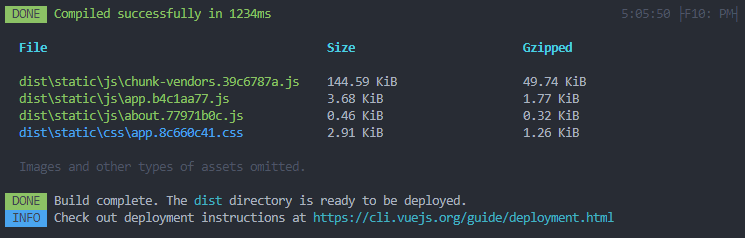

# quick-to-spell

## 技术栈

框架：Vue3.0

状态管理：Vuex

包管理工具：npm

网络请求：axios

util 库：lodash

版本管理工具：Git（husky）

Css 方案：Sass

模块化打包：webpack

自动化构建：npm script

代码质量：EsLint + prettier

代码风格：https://github.com/BingKui/javascript-zh/blob/master/README.md

调试：DevTools, vscode

单元测试: Jest

移动端网页适配：VW 方案

## 项目搭建

### [vue-cli](https://cli.vuejs.org/zh/guide/creating-a-project.html#vue-create)

### 核心依赖

- vuex
- vue-router
- EsLint
- prettier
- jest
- axios

### 其他依赖

✅ autoprefixer: 解决不同浏览器 css 前缀问题

✅ postcss-import: 解决 css 引入问题

✅ vant: 组件库

✅ husky @commitlint/config-conventional @commitlint/cli: git 提交规范

✅ dayjs: 日期处理

✅ babel-plugin-transform-remove-console: 移除 log 代码

移动端适配：

✅ postcss-import: VW 适配方案核心插件

✅ [viewport-units-buggyfill](https://github.com/rodneyrehm/viewport-units-buggyfill): 移动端 VW 适配 buggyfill

> This is a buggyfill (fixing bad behavior), not a polyfill (adding missing behavior).

✅ postcss-viewport-units: 服务`viewport-units-buggyfill`。自动为 `viewport-units-buggyfill`添加 `content`属性

### 开发准备

- 增加.eslintrc 和.prettierrc 配置文件。
  vscode 同时设置 lint on save 和 format on save 方便开发。

## Start

```
npm install
```

### Run

```
npm run serve
```

### Build

```
npm run build
```



### Test

```
npm run test:unit
```

### Lints and fixes files

```
npm run lint
```
